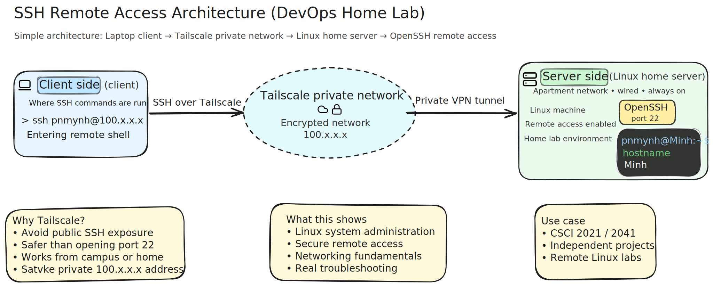

# devops-ssh-lab

A beginner-friendly Linux and networking lab focused on secure SSH administration over a private Tailscale network.

> Update: I switched this lab environment from Ubuntu to CachyOS (Arch-based), and the scripts now use Arch tooling (`pacman`, `sshd`).

## Overview

This project documents a hands-on setup process for remote administration of a Linux server from a laptop. The focus is on practical DevOps fundamentals: installing and configuring OpenSSH, securing access with SSH keys, using Tailscale for private connectivity, and debugging real setup issues.

This is **not** a deployment project. It does not include Kubernetes, cloud hosting, or application rollout workflows. The scope is infrastructure access, security basics, and troubleshooting.

## Context / Motivation

This project grew out of my coursework at the University of Minnesota, Twin Cities, especially CSCI 2021 and CSCI 2041, where working in Linux environments and accessing remote lab systems is part of normal workflow. I built this repo to turn that experience into a documented, repeatable home-lab setup focused on practical remote administration.

## Why This Project Matters

Remote Linux access is a core DevOps skill. In many real environments, the first task is not deploying an app, but safely reaching and maintaining infrastructure.

This lab demonstrates how to:

- establish reliable SSH access
- reduce attack surface with secure SSH settings
- avoid exposing port 22 publicly by using Tailscale
- investigate and fix common connectivity and configuration issues
- document operational decisions clearly

## Architecture

```text
Laptop (SSH client)
    |
    v
Tailscale private network
    |
    v
Linux server (SSH server)
    |
    v
OpenSSH secure remote administration
```



Detailed notes: `docs/architecture.md`

## Features

- Scripted OpenSSH installation for CachyOS/Arch (`setup_ssh.sh`)
- Scripted SSH hardening with backup-first workflow (`secure_ssh.sh`)
- Scripted Tailscale installation with manual login step on CachyOS/Arch (`install_tailscale.sh`)
- Troubleshooting guide based on real setup issues (`docs/troubleshooting.md`)
- Practical operator notes (`NOTES.md`)

## Demo

Example successful remote login over Tailscale:

```bash
ssh pnmynh@100.x.x.x
pnmynh@Minh:~$
```

This demonstrates the full path is working in practice: laptop client -> Tailscale private network -> Linux SSH server. It also confirms account targeting (`pnmynh`) and network addressing (`100.x.x.x`) are correct.

## Setup Summary

1. Install and start OpenSSH on the CachyOS/Arch server:

   ```bash
   chmod +x setup_ssh.sh
   ./setup_ssh.sh
   ```

2. Install Tailscale on the CachyOS/Arch server:

   ```bash
   chmod +x install_tailscale.sh
   ./install_tailscale.sh
   sudo tailscale up
   ```

3. Ensure Tailscale is also running on the laptop (client), then get server Tailscale IP:

   ```bash
   tailscale ip -4
   ```

4. Test SSH from laptop to server:

   ```bash
   ssh youruser@100.x.y.z
   ```

5. After key-based login is confirmed, apply SSH hardening:

   ```bash
   chmod +x secure_ssh.sh
    ./secure_ssh.sh
    ```

## Distro Note

The security and networking workflow is the same across Linux distros, but package manager and service names can differ.

| Task | Ubuntu/Debian | CachyOS/Arch |
|---|---|---|
| Install OpenSSH | `sudo apt install -y openssh-server` | `sudo pacman -S --noconfirm openssh` |
| SSH service name | `ssh` | `sshd` |
| Check SSH service | `sudo systemctl status ssh --no-pager` | `sudo systemctl status sshd --no-pager` |
| Install Tailscale | `curl -fsSL https://tailscale.com/install.sh \| sh` | `sudo pacman -S --noconfirm tailscale` |
| Refresh packages | `sudo apt update` | `sudo pacman -Syu` |

## Tech Used

- Linux (CachyOS/Arch)
- OpenSSH server/client
- Tailscale (WireGuard-based private networking)
- Bash scripting
- Basic system administration tools (`systemctl`, `sshd`, `ip`, `hostname`)

## Security Practices

- Prefer private network SSH access (Tailscale) over exposing public SSH
- Disable root SSH login
- Disable password authentication after key setup is verified
- Keep public key authentication enabled
- Back up `sshd_config` before making security changes
- Validate SSH service status after configuration updates

### Why Tailscale Instead of Public SSH?

Exposing SSH on a public IP increases scanning and brute-force risk, especially in beginner lab environments. Tailscale allows remote access through a private, identity-based network, reducing exposure while keeping setup simple.

## Troubleshooting Highlights

This project came from a real debugging workflow, not a one-pass setup. Key issues I had to investigate:

- confusion between username and hostname in SSH commands
- confusion between local IP, public IP, and Tailscale IP selection
- broken package mirrors that blocked Tailscale installation
- possible Cloudflare WARP interference affecting routing and DNS behavior
- SSH hanging because the client laptop also needed Tailscale active
- accidentally SSH-ing into the same machine instead of testing laptop -> server access

These issues forced a step-by-step troubleshooting process: validate service status, confirm addressing, verify both endpoints are on the same tailnet, then harden SSH only after stable access.

See: `docs/troubleshooting.md` and `NOTES.md`

## Skills Demonstrated

- Linux package/service management (`pacman`, `systemctl`)
- SSH installation, validation, and hardening
- Private remote access design with Tailscale
- Network troubleshooting and connectivity validation
- Operational documentation and reproducible setup scripts

## Future Improvements

- Add CachyOS and Arch test matrix notes
- Add UFW examples for local LAN hardening
- Add optional fail2ban profile for SSH
- Add shellcheck and CI validation for scripts
- Add key rotation and access review checklist

## Resume-Ready Bullet

- Built and documented a Linux remote-access home lab using OpenSSH and Tailscale; implemented SSH hardening (no root, key-only auth), created reproducible setup scripts, and resolved real-world connectivity issues across local and private overlay networks.
